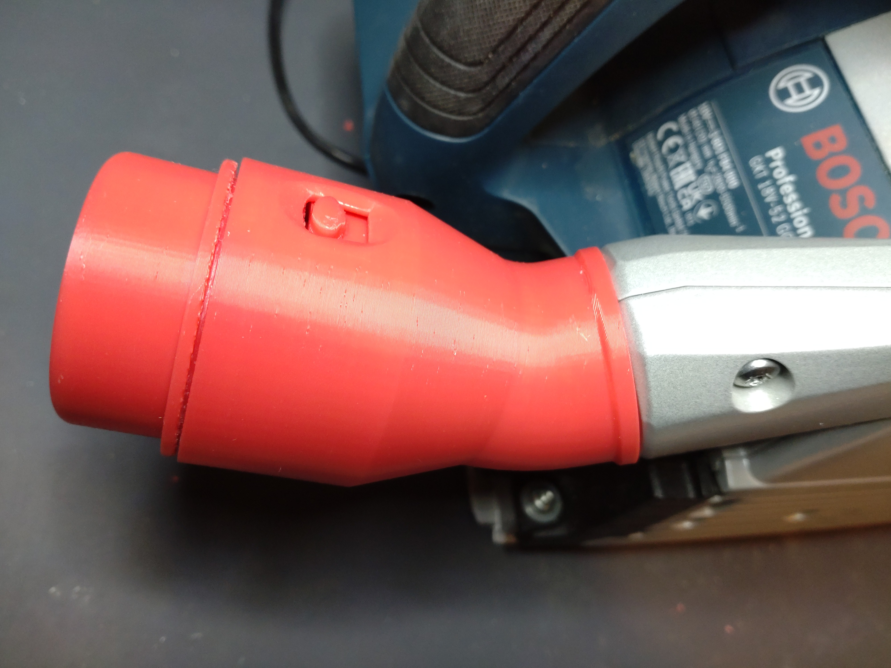
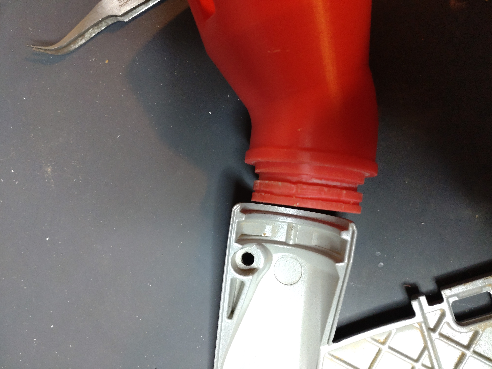
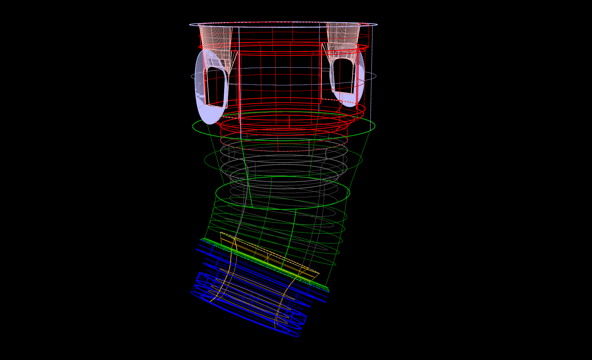
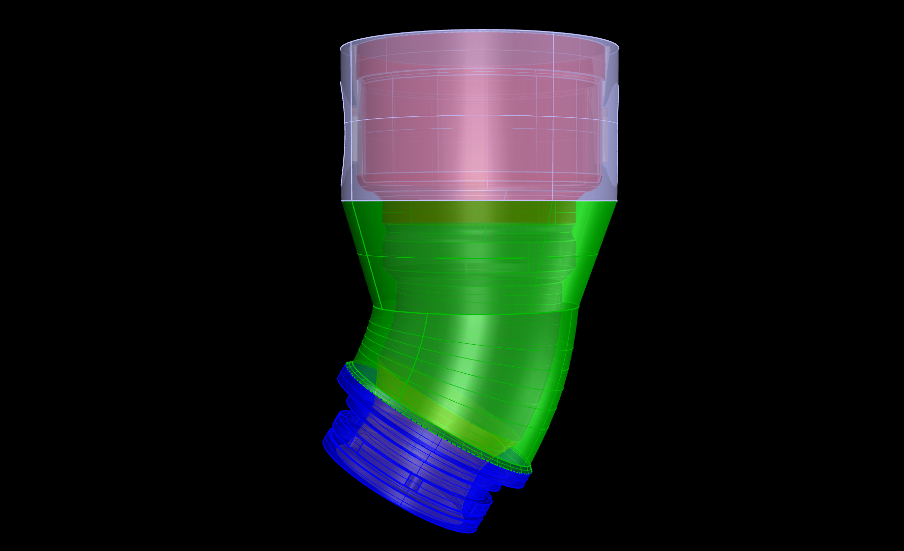
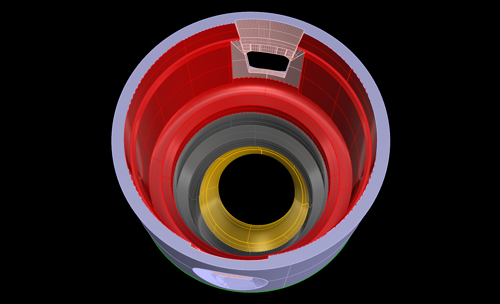

# Bosch-GKT-18V-52-GC-to-click-clean-Adapter
Adapater for the Bosch GKT 18V-52 GC plunge saw to connect a Bosch click&amp;clean vaccuum cleaner

I recently bought this Bosch plunge saw together with a Bosch GAS 18V L vaccum cleaner. 
To connect the vaccum cleaner, an adapter for the click&clean system is needed. 
I found a stl file on printables but it was not that accurated designed.
So here is my own one. 

I also created an additional adapter to connect the original dust bag instead of the click&clean tube. 
Have a look in my repos. There is also a dust cover for the hole on the side.

## View

 

  

 
 
 

